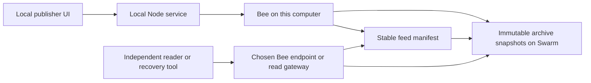

**Road to Devcon V - archive build plan**

Implementation update: the user requested Next.js + TypeScript + shadcn/ui and project-local files. The implemented system and actual test results are documented in [README](../README.md) and [evidence](../evidence/README.md). This document retains the planning baseline and goals; its checklist is not a claim that every proposed test or recording has been completed.

Prepared September 19, 2026. Planning baseline: approximately 31 hours until the September 20, 11:11 PM IST submission deadline. Recheck the clock when implementation starts.

**1. Outcome and agreed direction**

Build Problem 1, “Eight hundred winters, one lapsed invoice”: a usable manuscript archive published through a Bee node we operate. Someone receiving one archive address must be able to browse and recover every file without the publisher's application, account, private key, or local catalogue.

The user selected their computer for the initial node. Infrastructure depth is a priority based on participant feedback; that feedback is an informal signal, not a published scoring rule. The published rubric remains the acceptance baseline. No project submission is authorised.

Working product name: **Folio**. Naming is provisional. The central demonstration is publish, update at the same address, close the publisher, and recover all files independently.

The public workspace has eight checks worth 80 points, plus 20 points for interpretation, usability and code craft. The event FAQ says the best problem score becomes the battle score. Complete this entry before considering a second problem. [Workspace](https://www.loops.house/road-to-devcon-v/workspace) · [Event FAQ](https://www.loops.house/road-to-devcon-v)

**2. Current environment**

| Item | Verified during planning |
| --- | --- |
| Computer | Apple Silicon, 8 GiB RAM, approximately 56 GiB available disk space |
| Runtime | Node 22.21.1 and npm 10.9.4 |
| Bee | No response at localhost:1633 in the preliminary check |
| CLI tools | bee and swarm-cli were not on PATH in the preliminary check |
| Project | No application code found in this workspace |
| Loops | Authenticated; no project record returned during initial review |
| bee-js | npm reports 13.1.0; its engine metadata identifies Bee 2.8.1 and API 8.1.0 |

Use `@ethersphere/bee-js` pinned exactly to the tested version, initially 13.1.0. Verify the installed Bee/API combination in the first integration milestone and record the working versions in the README and lockfile.

**3. Node and operating model**

Use the official Bee Apple Silicon binary, installed and checksum-verified inside this project. A project-local launcher maintains the data directory and loopback API. A hidden-prompt helper redeems the event gift into the node wallet. Verify light mode before uploads and record only public node information in the repo. [Desktop installation](https://docs.ethswarm.org/docs/desktop/install/)

Keep the Bee API bound to loopback. The local publisher service talks to it; no tunnel or public write endpoint is required. Keep the computer awake during uploads and the demonstration. Document start, stop, restart, data-directory backup and restoration. This is a locally operated node, without a promise of continuous hosting while the computer sleeps.

Use a dedicated feed-signing key separate from the Bee wallet. Store secrets in ignored, permission-restricted `.runtime/` files inside the project as requested; exclude them from Git and browser bundles. Back up the node and publisher credentials privately; public recovery must never need them. [Feed requirements](https://bee-js.ethswarm.org/docs/soc-and-feeds/)

Before any storage allocation, inspect available gift funds and obtain a live cost estimate. Choose enough effective capacity for the demo, repeated snapshots and overhead, plus a useful retention period and one renewal demonstration. Prefer roughly a week of runway if the supplied balance allows it; record the actual estimate. Additional paid funding is an unresolved choice, not assumed.

**4. Product experience**

The publisher has three focused views:

- **Collection:** folio thumbnails, titles, descriptions, original filenames, and a clear create/update action.
- **Publish:** review changed files, upload progress, network verification, and a single copyable archive link.
- **Storage:** node readiness, available capacity, estimated remaining lifetime, when it was checked, and a quoted renewal action.

The reader opens directly into the archive: collection description, folio grid, legible image viewer, individual download and “Recover entire archive.” Technical identifiers live in an expandable details panel and the recovery instructions.

Use a restrained archival visual direction: warm paper tones, ink typography, high-contrast controls, generous image space and visible preservation status. Keyboard operation, accessible labels, responsive layouts and useful error states are part of completion.

Prepare a small, openly licensed or clearly labelled synthetic collection, approximately 8–15 files and under 25 MB. Include Unicode filenames, nested paths, an image, text and a file larger than 4 KB. Keep provenance and licence information with the sample. Do not claim sample material is an authentic historical manuscript unless sourced accordingly.

**5. Architecture**



Implementation shape:

- Next.js App Router, TypeScript, Tailwind CSS and shadcn/ui for the local publisher.
- Next.js Node-runtime route handlers serving the publisher API from the same local origin. It owns filesystem staging, signing and Bee writes. Bind to loopback; require a local session and validate origins for mutations.
- A separately runnable static reader and a Node recovery entrypoint. Neither depends on the publisher service. They may use bee-js and the documented archive format.
- No application database in the archive read path. Local drafts and temporary staging are disposable. Editing a published archive starts by reading its current inventory from Swarm.
- Serve the static reader with the archive where the chosen gateway supports it. Also provide a separately hosted or locally runnable reader. Confirm the actual gateway behavior during integration before choosing the final sharing URL.

Proposed repository layout:

```text
src/app/                   local Next.js interface and API
reader/                    standalone browser reader
src/lib/server/            upload and signing orchestration
src/lib/archive-format.ts  schema and public types
src/lib/network.ts         focused Bee integration
tools/recover.ts           independent recovery entrypoint
docs/                      setup, format, recovery and operating instructions
evidence/                  public identifiers and actual verification results
```

**6. Archive format and addressing**

Publish each complete version as a Swarm directory collection, containing `archive.json`, `bootstrap.json`, the reader assets and `files/`. Directory manifests support path-based retrieval, and an index document can provide the entry page. [Manifest documentation](https://docs.ethswarm.org/docs/develop/tools-and-features/manifests/)

Our `archive.json` format will include:

- Format identifier and version; archive identifier, title and description.
- Revision label, publication time and previous snapshot reference when one exists.
- Every recoverable file's safe relative path, original filename, media type, byte count and SHA-256 checksum.
- Captions and source/licence metadata where supplied.

`bootstrap.json` contains only public identifiers: feed owner, topic and stable manifest reference. Create the feed manifest before publishing the first snapshot so its reference can be included without a circular content hash.

Create one feed manifest for the archive. Each publication uploads a complete new collection and appends its reference to that feed. The sharing address remains stable. Persist the real owner, topic and manifest reference in a tracked public descriptor after the first successful publication; do not populate it with invented network evidence.

Use `bee.feed.makeWriter`, `uploadReference`, `bee.feed.makeReader` and `downloadReference`. Resolve the next index from the network immediately before every write, including retries, or use the SDK's verified automatic append behavior. Serialise local publication jobs. Treat only a confirmed missing first update as an empty feed; timeouts and other network failures must not become index zero. [Feed API](https://bee-js.ethswarm.org/docs/api/classes/Feed/) · [Feed semantics](https://bee-js.ethswarm.org/docs/soc-and-feeds/)

**7. Publishing and recovery contracts**

Publishing sequence:

1. Check node readiness, selected batch usability, capacity and signing configuration.
2. Read the existing archive from Swarm when updating; build a complete staged snapshot.
3. Validate filenames, detect duplicates, compute checksums and write the inventory.
4. Upload the directory using the Node-supported collection method. Prevent an unfinished snapshot from becoming the current archive.
5. Verify the new inventory and files through an independent endpoint, with bounded retries for propagation.
6. Append the new collection reference to the feed using a freshly resolved index.
7. Verify that the stable address resolves to the new snapshot, then display the successful publication receipt.

An SDK upload result can precede network availability. Use non-deferred uploads where supported or explicitly track completion; independent reads are still part of our release check. [Upload behavior](https://bee-js.ethswarm.org/docs/upload-download/)

Recovery accepts the single public archive address and a selectable Bee/read endpoint. Owner-plus-topic input is an additional documented interface. It requires no login or local publisher files.

For manifest-only input, bootstrap the public feed identifiers from `bootstrap.json` via `/bzz/<manifest>/bootstrap.json`. Resolve the feed once to an immutable collection reference, then fetch the inventory and every file from that snapshot. This prevents a concurrent publication from mixing versions during recovery. Validate this bootstrap route in the first reader integration test.

The recovery implementation validates the schema and safe paths, downloads with bounded concurrency, checks each file's size and checksum, and reports every missing or corrupt file. A partial recovery is never labelled complete. Store a recovery report beside the output. The browser offers a convenient archive download for the small demo; the CLI bounds streamed downloads and buffers one file at a time, without holding the entire collection in memory.

Always use the endpoint family matching the uploaded content. Collection paths are read through the collection root, rather than treating manifest internals as standalone file addresses. [Collection retrieval](https://bee-js.ethswarm.org/docs/upload-download/)

**8. Storage health and renewal**

Use an immutable batch for the initial collection, manifest and feed updates, and explicitly verify that property. Keeping the archive's initial storage under one tracked batch makes its dependencies easier to maintain.

Read usability, capacity and estimated remaining lifetime from the node. Display an estimate with its observation time; stale or unavailable data is visibly marked. Storage pricing can change, so avoid a guaranteed expiry promise. Quote an extension, execute the chosen renewal once, then reread the batch to confirm the result. [Storage APIs and lifetime estimates](https://bee-js.ethswarm.org/docs/storage/)

The reader can show a clearly dated publication-time storage observation. It cannot claim that observation is current while the publisher's node is unavailable. Live maintenance is a publisher-side function.

Preserve the stamp dependencies of the stable manifest, feed history and referenced files. Buying a new batch later does not by itself extend the original batch. A future multi-batch design must track every dependency; do not introduce that complexity into the first release.

**9. Rubric traceability**

| Published check | Points | Planned implementation and evidence |
| --- | ---: | --- |
| Feed-based archive address | 8 | Stable manifest; two different snapshots reached through the same address |
| Tracked owner and topic | 6 | Real public descriptor in `evidence/`, with a copyable recovery example |
| Network-derived next index | 16 | Fresh feed read or verified automatic append; restart and retry coverage |
| Feed contains a reference | 12 | Collection upload followed by `uploadReference`; demo includes a multi-chunk file |
| Recovery from public identifiers | 14 | Clean-directory recovery with no publisher configuration or credentials |
| Node-derived batch lifetime | 8 | Visible timestamped node observation and recorded renewal result |
| Empty-feed handling | 8 | Defined first-publication behavior and distinct network-failure handling |
| No tracked secrets | 8 | Ignored private configuration; checks of tracked files, bundles and Git history |
| Product judgment and craft | 20 | Usable archive, primary network read path, clear maintenance model and reproducible demonstration |

Source: the signed-in [Test Cases tab](https://www.loops.house/road-to-devcon-v/workspace) and the free Loops evaluator prompt for `archive-that-outlives-its-host`, reviewed during planning. These are targets, not earned scores.

**10. Build sequence and completion gates**

Estimates are working-time budgets, not commitments. Preserve several hours before the deadline for network delays, rest, recording and final fixes.

| Milestone | Budget | Gate before moving on |
| --- | --- | --- |
| 1. Node and storage | 2–3 hours | Funded light node, compatible SDK, usable batch, one small upload independently retrieved |
| 2. Publishing core | 3–4 hours | Two complete archive versions, unchanged public address, actual public descriptor |
| 3. Recovery first | 2–3 hours | Fresh recovery verifies every file with only public identifiers and another endpoint |
| 4. Product interface | 4–5 hours | Publisher, reader, progress, previews and recovery work through real services |
| 5. Maintenance and failures | 2–3 hours | TTL view, renewal demonstration, retries, empty feed and partial-download behavior |
| 6. Evidence and review | 2–3 hours | Runnable README, demo recording, rubric audit and no tracked secrets |

If node setup takes longer, reduce visual extras and sample size while continuing diagnosis. Keep the real node and independent recovery in scope. Do not quietly replace them with mocks or subsidised uploads. If a required network operation remains impossible, report the exact failed gate.

**11. Meaningful verification**

- Publish a first version, restart the publisher and publish a second version. Assert unchanged manifest address and correct new content.
- Read an empty feed and distinguish that result from a timeout or unavailable node.
- Interrupt a publication before the feed append; the last good archive must remain readable.
- Exercise ambiguous write failure recovery: reread the network before retrying, without overwriting or skipping indices.
- Resolve one snapshot and continue recovery while a newer version is published; recovered files must remain internally consistent.
- Recover Unicode/nested filenames and a file over 4 KB. Reject traversal paths and checksum mismatches.
- Make one file unavailable; return an explicit partial-recovery report.
- Run a fresh read through an independent endpoint with publisher state absent. After propagation is verified, temporarily stop our Bee process and repeat retrieval; restart it afterward. Never delete node data or keys for this test.
- Record live batch observations before and after a real renewal. Use synthetic fixtures only for failure-state tests, clearly separate from live evidence.
- Check the local API boundary, browser bundles and tracked history for accidental secret exposure.

Tests should cover these consequential behaviors rather than duplicate framework scaffolding. Run type checking, a production build and focused browser checks for the actual demo path.

**12. Demonstration and judge-facing evidence**

The short demonstration should show:

1. The running node and its actual storage status.
2. Publication of the first collection and its stable address.
3. A changed collection appearing at the same address.
4. The independent reader and complete verified recovery with the publisher closed.
5. An actual storage renewal and its updated observation.

Keep a small, reproducible evidence bundle: public node information, batch identifier, stable manifest, feed owner/topic and indices, snapshot references, checksums, endpoint and timestamp of verification, recovery output and renewal evidence. Record actual outcomes only. A receipt documents what was checked at that time; it does not establish indefinite availability.

The GitHub README will begin with the problem solved, a demo link, the real public archive address and a short verification procedure. Add a requirements table linking each rubric item to its implementation, relevant test and live-run evidence. Mark incomplete features and unverified claims explicitly.

Planned evidence layout (these files will be generated only after real runs):

```text
evidence/
  published-archive.json       public feed owner, topic and stable manifest
  live-run-<timestamp>/
    run.json                   commit SHA, versions, UTC times and tested endpoints
    node.json                  allowlisted node mode and public status fields
    storage-before.json        selected batch's observed capacity and lifetime
    publications.json          two snapshot references and observed feed indices
    recovery.json              inventory, per-file checksums and recovery outcome
    storage-after.json         observed renewal outcome and transaction hash if obtained
    limitations.md             what was checked and what remains unverified
  screenshots/                 redacted node, publisher and reader captures
```

Document the distinction between a static observation and a check a reviewer can repeat. Screenshots and captured JSON support the account of a run. Network retrieval of the published references and any recorded transaction provide independently checkable evidence. None of these proves continuous uptime.

Build a read-only verifier that accepts the public descriptor plus an endpoint. It resolves the feed, validates the stored format, retrieves all files and checks their sizes and hashes, then exits unsuccessfully on a missing or mismatched file. Include expected output from an actual run and let reviewers select another endpoint. The descriptor supplies identifiers only; the authoritative inventory must come from Swarm.

Run deterministic tests, type checking and a production build in GitHub Actions. Keep live network verification separately labelled so an unavailable gateway is distinguishable from a code-test failure. CI requires no publisher key or funded write access. Save a clean-environment recovery recording with the local publisher closed and Bee temporarily stopped; include it in a short demo or link it from the README.

Evidence export must allowlist public fields rather than dump configuration or raw logs. Exclude gift codes, keys, mnemonics, auth headers, authenticated URLs and personal filesystem paths. Scan reports, screenshots, built assets and tracked history before pushing. This records work; it does not authorise pushing or submitting the project during this planning pass.

Use the free Loops evaluator after implementation to identify missing call paths. Its output is an internal review, not the final judge's verdict. The final README must make setup and recovery possible for a new reader.

**13. Scope boundary and later extension**

The first delivery is one public archive with complete publishing, reading, recovery and maintenance. Full-node operation, remote VPS hosting, multi-party governance, publisher succession, private archives, OCR and AI features are deferred.

Problem 3 can reuse the archive work later, but needs its own design: a stable authority separate from the publisher, repeatable succession, storage custody decisions and a real documented handoff. It should begin only after this plan's core gates pass and the user chooses to extend scope.

The user subsequently authorised implementation and event gift redemption. The current build and actual results are linked above. Submission remains explicitly prohibited until the user changes that instruction.
